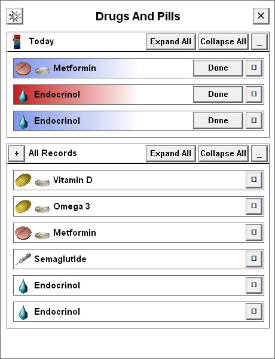

# Drugs and Pills

Medication To-Do List.
A small educational project for learning WinApi and C++, don't use it unironically.

## Usage

- After launched, pill icon will appear on the taskbar.
- Click on it to open Main Window.
- Click on "Plus" button to open Setup Record window.
- Fill fields of a new record and click on Confirm button.
- The record should appear in All Records list and, if is usable today, in Today list.
- Click on "Gear" button to open Settings window.
- Click on "X" button to close the Main window.
- To fully close the application, click RMB on the pill icon on the taskbar and then click on a Close button.

## Building

- Make sure cmake are installed
- Run 'git clone https://github.com/SirGoxic/DrugsAndPills.git --recursive'
- Run 'cmake .'
- Run 'cmake --build .'
- Executable will be in the 'bin/(build type)' directory